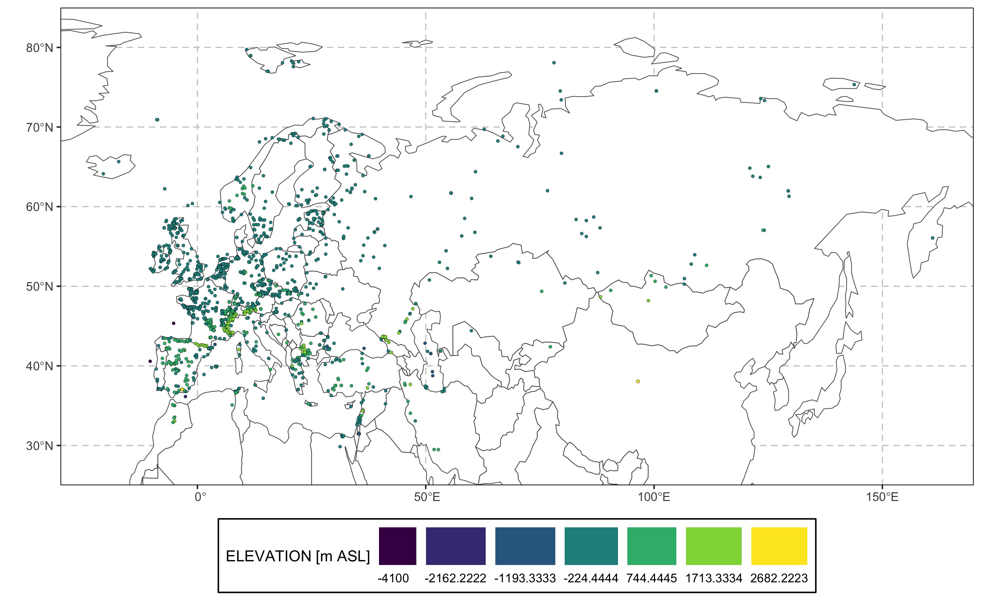
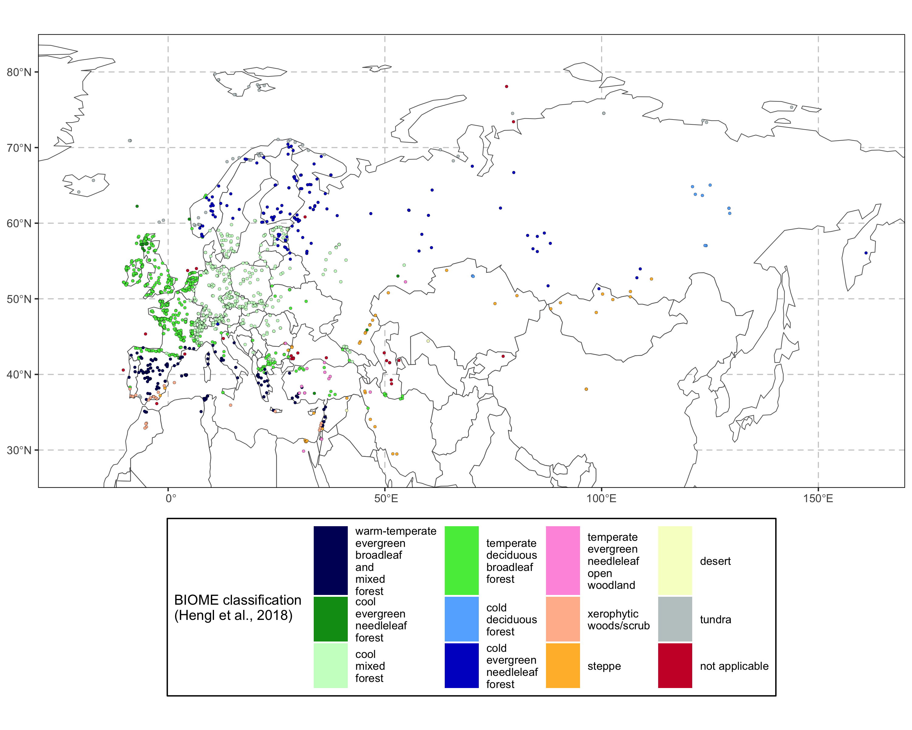

<!-- README.md is generated from README.Rmd. Please edit that file -->

# special.epd: SPECIAL Research Group’s Version of the European Pollen Database (EPD)

<!-- S<sub>PECIAL</sub> <sub>R</sub>e<sub>search group's version of the</sub> E<sub>uropean</sub> Po<sub>llen</sub> D<sub>atabase (EPD)</sub>  -->
<!-- *S*PECIAL R*e*search group's version of the *E*uropean *Po*llen *D*atabase (EPD)  -->
<!-- **S**PECIAL R**e**search group's version of the **E**uropean **Po**llen **D**atabase (EPD)  -->
<!--  -->
<!-- badges: start -->

[](https://github.com/special-uor/special.epd)
[](https://github.com/special-uor/special.epd/actions)
[](https://cran.r-project.org/package=special.epd)
<!-- badges: end -->

The goal of `special.epd` is to provide access to the SPECIAL Research
group’s version of the European Pollen Database (EPD).

## Installation

You **can(not)** install the released version of `special.epd` from
[CRAN](https://CRAN.R-project.org) with:

``` r
install.packages("special.epd")
```

And the development version from
[GitHub](https://github.com/special-uor/special.epd) with:

``` r
# install.packages("remotes")
remotes::install_github("special-uor/special.epd", "dev")
```

## Example

#### Load tables to working environment

``` r
data("entity", package = "special.epd")
data("date_info", package = "special.epd")
data("sample", package = "special.epd")
data("age_model", package = "special.epd")
data("pollen_count", package = "special.epd")
```

#### Create a snapshot of entities

The function `special.epd::snapshot` takes few different parameters and
based on the first one, `x`, it returns a variety of snapshots.

This function returns a list with 5 components:

-   `entity`: data frame (`tibble` object) with the metadata associated
    to the entities.
-   `date_info`: data frame (`tibble` object) with the dating
    information. This one can be linked to the `entity` table using the
    column called `ID_ENTITY`.
-   `sample`: data frame (`tibble` object) with the sampling
    information. This one can be linked to the `entity` table using the
    column called `ID_ENTITY`.
-   `age_model`: : data frame (`tibble` object) with the “new” age
    models (created with
    [**ageR**](https://github.com/special-uor/ageR)). This one can be
    linked to the `sample` table using the column called `ID_SAMPLE`.
-   `pollen_count`: list of data frames (`tibble` objects) containing
    the pollen counts for 3 levels of “amalgamation”:
    -   `clean`
    -   `intermediate`
    -   `amalgamated`

    All these data frames can be linked to the `sample` table using the
    column called `ID_SAMPLE`.

:warning: **NOTE:** the output is returned “invisibly”, so you should
assign the output of the function to a variable.

``` r
output <- special.epd::snapshot(...)
output$entity
output$date_info
output$sample
output$pollen_count$clean
output$pollen_count$intermediate
output$pollen_count$intermediate
```

##### Using the `entity_name`

``` r
special.epd::snapshot("MBA3")
#> # A tibble: 1 × 8
#>   ID_SITE ID_ENTITY site_name    entity_name dates samples age_model
#>     <int>     <int> <chr>        <chr>       <int>   <int>     <int>
#> 1       1         1 Aalkistensee MBA3            7      57        57
#> # … with 1 more variable: pollen_counts <tibble[,3]>
```

##### Using the `site_name`

``` r
special.epd::snapshot("Abant Golu", use_site_name = TRUE)
#> # A tibble: 1 × 8
#>   ID_SITE ID_ENTITY site_name  entity_name dates samples age_model
#>     <int>     <int> <chr>      <chr>       <int>   <int>     <int>
#> 1       4         4 Abant Golu ABANT           5      65        65
#> # … with 1 more variable: pollen_counts <tibble[,3]>
```

##### Using the `ID_ENTITY`

``` r
special.epd::snapshot(2)
#> # A tibble: 1 × 8
#>   ID_SITE ID_ENTITY site_name entity_name dates samples age_model
#>     <int>     <int> <chr>     <chr>       <int>   <int>     <int>
#> 1       2         2 Aammiq    AMMIQ           4      96        96
#> # … with 1 more variable: pollen_counts <tibble[,3]>
```

##### Using the `ID_SITE`

``` r
special.epd::snapshot(3, use_id_site = TRUE)
#> # A tibble: 1 × 8
#>   ID_SITE ID_ENTITY site_name        entity_name dates samples age_model
#>     <int>     <int> <chr>            <chr>       <int>   <int>     <int>
#> 1       3         3 Aansser peat bog ANS             4      64        64
#> # … with 1 more variable: pollen_counts <tibble[,3]>
```

##### Extracting multiple records at once

``` r
special.epd::snapshot(1:10)
#> # A tibble: 10 × 8
#>    ID_SITE ID_ENTITY site_name          entity_name dates samples age_model
#>      <int>     <int> <chr>              <chr>       <int>   <int>     <int>
#>  1       1         1 Aalkistensee       MBA3            7      57        57
#>  2       2         2 Aammiq             AMMIQ           4      96        96
#>  3       3         3 Aansser peat bog   ANS             4      64        64
#>  4       4         4 Abant Golu         ABANT           5      65        65
#>  5       5         5 Abborrtjarnen      ABBO            7     107       107
#>  6       6         6 Abernethy Forest   AF1974          7      49        49
#>  7       7         7 Abiare             ABIARE          1      34         0
#>  8       8         8 Above Cadubh       ACH3            1       7         0
#>  9       9         9 Above Loch an Eang AFF5            4      10        10
#> 10      10        10 Achit-Nur          ACHIT8          4      20        20
#> # … with 1 more variable: pollen_counts <tibble[,3]>
```

##### Extracting all the records at once

This will run very slow, so if only few entities are required, it would
be better to indicate which, based on the previous examples.

``` r
out <- special.epd::snapshot()
```

#### Export data as individual CSV files

The function `special.epd::write_csvs` takes to parameters:

-   `.data`: a list of class `snapshot`, this one can be generated using
    the function `special.epd::snapshot` (see previous section).
-   `prefix`: a prefix name to be included in each individual files,
    this prefix can include a relative or absolute path to a directory
    in the local machine.

##### Without a path

``` r
`%>%` <- special.epd::`%>%`
special.epd::snapshot("MBA3") %>%
  special.epd::write_csvs(prefix = "MBA3")
#> # A tibble: 1 × 8
#>   ID_SITE ID_ENTITY site_name    entity_name dates samples age_model
#>     <int>     <int> <chr>        <chr>       <int>   <int>     <int>
#> 1       1         1 Aalkistensee MBA3            7      57        57
#> # … with 1 more variable: pollen_counts <tibble[,3]>
```

###### Output

    #>                                 levelName
    #> 1 .                                      
    #> 2  ¦--MBA3_age_model.csv                 
    #> 3  ¦--MBA3_dates.csv                     
    #> 4  ¦--MBA3_metadata.csv                  
    #> 5  ¦--MBA3_pollen_counts_amalgamated.csv 
    #> 6  ¦--MBA3_pollen_counts_clean.csv       
    #> 7  ¦--MBA3_pollen_counts_intermediate.csv
    #> 8  °--MBA3_samples.csv

##### Including a path

``` r
`%>%` <- special.epd::`%>%`
special.epd::snapshot("MBA3") %>%
  special.epd::write_csvs(prefix = "/special.uor/epd/MBA3")
```

###### Output

    #>                                     levelName
    #> 1 special.uor                                
    #> 2  °--epd                                    
    #> 3      ¦--MBA3_age_model.csv                 
    #> 4      ¦--MBA3_dates.csv                     
    #> 5      ¦--MBA3_metadata.csv                  
    #> 6      ¦--MBA3_pollen_counts_amalgamated.csv 
    #> 7      ¦--MBA3_pollen_counts_clean.csv       
    #> 8      ¦--MBA3_pollen_counts_intermediate.csv
    #> 9      °--MBA3_samples.csv

## Spatial distribution of the entities

``` r
`%>%` <- special.epd::`%>%`
special.epd::entity %>%
  smpds::plot_climate(var = "elevation", units = "m ASL", 
                      ylim = c(25, 85),
                      xlim = c(-30, 170))
```



## Extract Potential Natural Vegetation (PNV)

Using the package `smpds` \[<https://github.com/special-uor/smpds>\] we
can extract the PNV for each entity and create a plot:

``` r
`%>%` <- special.epd::`%>%`
special.epd_pnv <- special.epd::entity %>%
  smpds::extract_biome()

# For a quicker execution
special.epd_pnv <- special.epd::entity %>%
  smpds::parallel_extract_biome(cpus = 4)

# Plot the PNV
special.epd_pnv %>%
  smpds::plot_biome(ylim = c(25, 85),
                    xlim = c(-30, 170))
```



## Summary of the database

``` r
`%>%` <- special.epd::`%>%`
special_epd_summary <- special.epd::db_summary()
tibble::tibble(
    `# Entities` = nrow(special_epd_summary),
    `with Dates` = sum(special_epd_summary$has_DATES, na.rm = TRUE),
    `with Age models (using IntCal20)` = sum(special_epd_summary$has_AM, na.rm = TRUE),
    `with Pollen counts` = sum(special_epd_summary$has_COUNTS, na.rm = TRUE)
  ) %>%
  knitr::kable()
```

| # Entities | with Dates | with Age models (using IntCal20) | with Pollen counts |
|-----------:|-----------:|---------------------------------:|-------------------:|
|       1667 |       1667 |                             1476 |               1667 |
